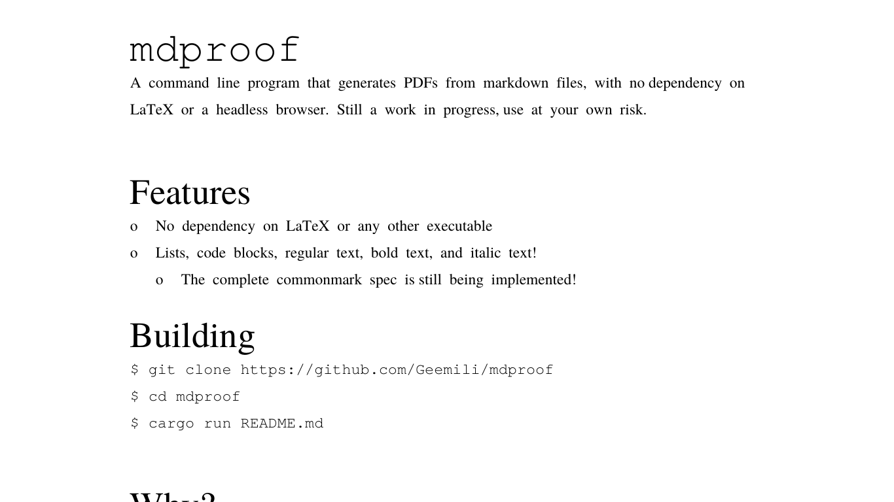

# `mdproof`

A command line program that generates PDFs from markdown files, with no
dependency on LaTeX or a headless browser. Still a work in progress,
use at your own risk.

## Features

- No dependency on LaTeX or any other executable
- Lists, code blocks, regular text, bold text, and italic text!
    - The complete commonmark spec is [still being implemented][]!

[still being implemented]: https://github.com/Geemili/mdproof/issues/1

## Screenshots



## Installation

```bash
$ git clone https://github.com/Geemili/mdproof
$ cd mdproof
$ cargo build
```

## Usage

```bash
$ cargo run README.md
$
$ # Or if you've copied `mdproof` to your `~/bin` folder
$ mdproof README.md
```

## Why?

There are already a plethora of ways to generate PDFs, including LaTeX, headless
browsers, or libreoffice. However, all of these methods pull in massive
dependencies, and can be difficult to set up correctly.

By comparison, this program relies on only a few (direct) dependencies, and can
be compiled into a single executable file.

The goal of this program is to compile markdown to pdf, without stepping through
dependency hell.
